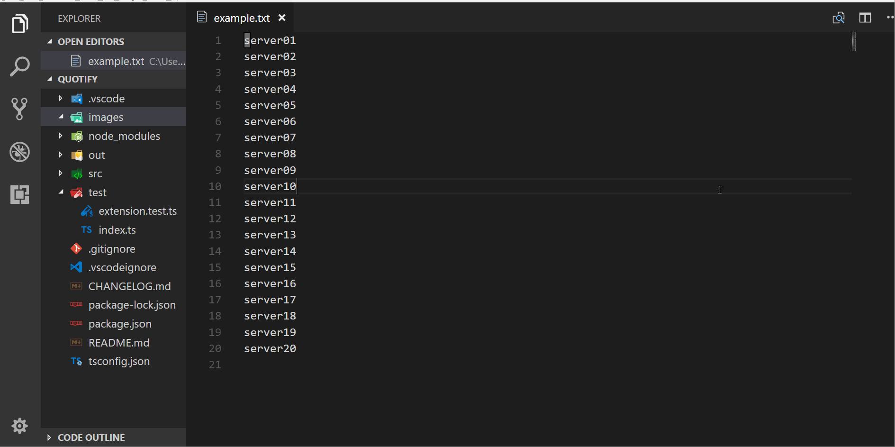

# quotify README

Quotify adds the ability to quote, unquote, and delimit with new lines text.
This is very specific but a really common issue I run into when I am using powershell to list server hostnames.
I've manually been doing this with sublime text for years so now it is an extension.

## Features
Quotes selected strings, unquotes, and separates with newlines

## Release Notes

### 0.0.2
Added example gif, updated package.json data, license, etc

### 0.0.1

Initial release of Quotify
